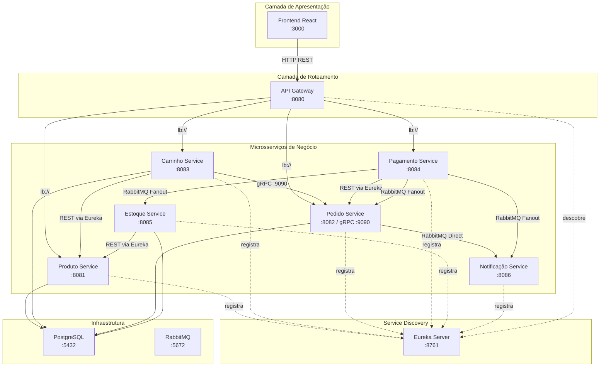
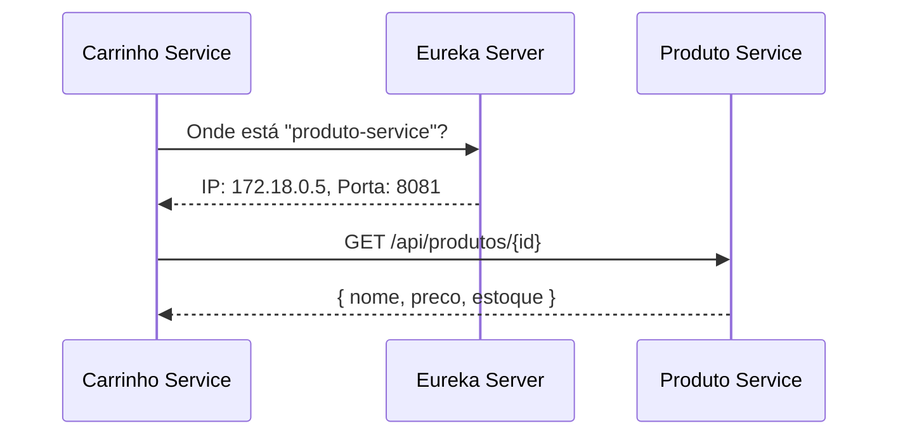
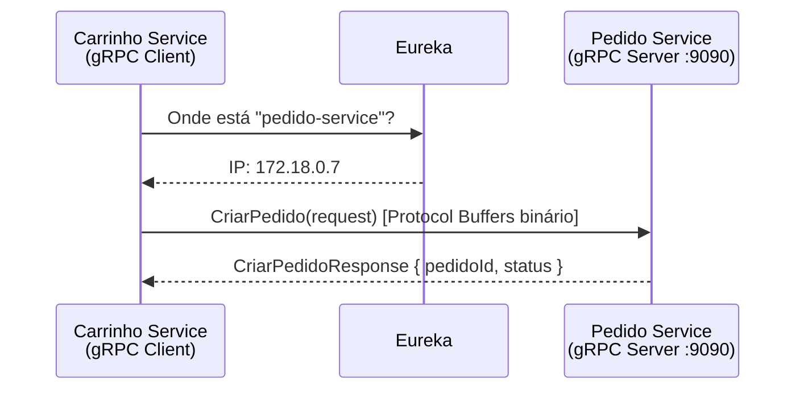
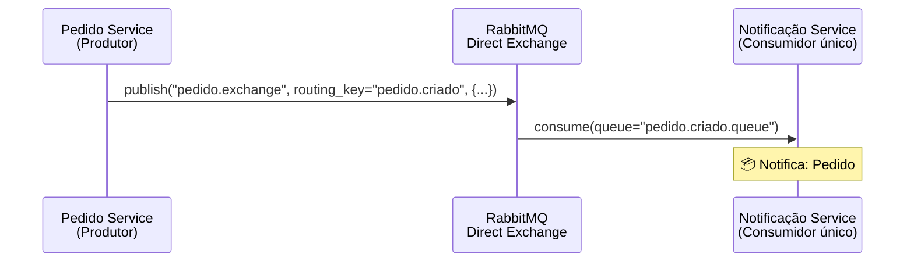
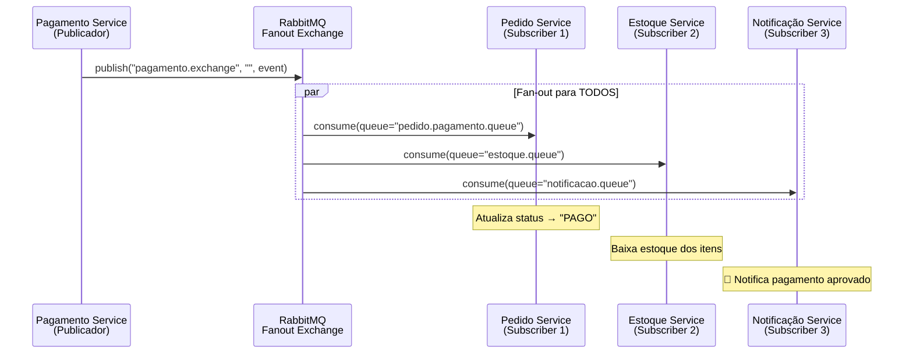
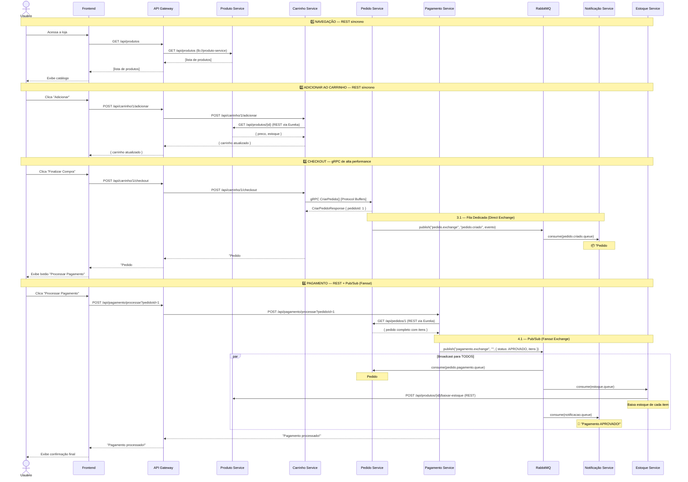
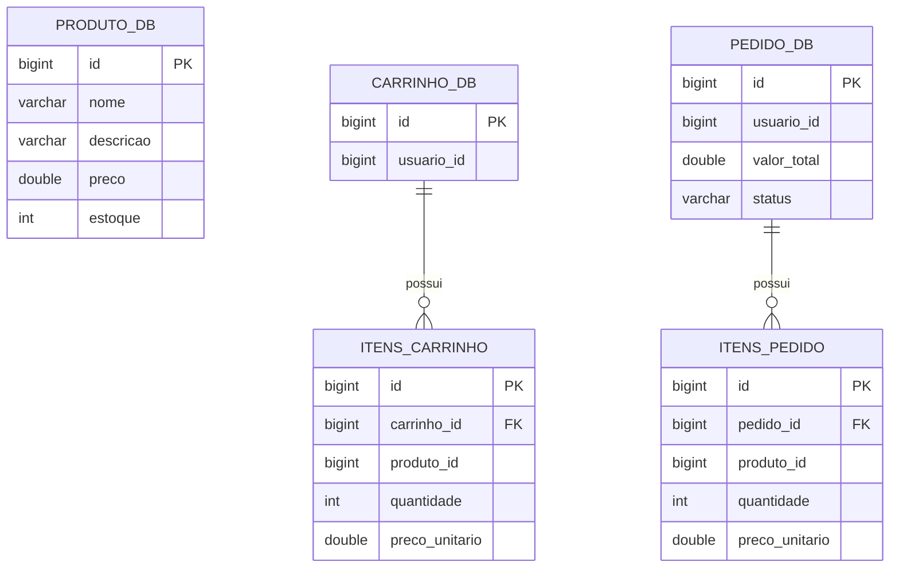

# 📋 Relatório Técnico Completo — ShopFlow E-commerce

> **Projeto**: ShopFlow — Plataforma de E-commerce Distribuída  
> **Disciplina**: Sistemas Distribuídos  
> **Data**: Junho de 2026  
> **Stack Principal**: Java 21, Spring Boot 3.2.5, Spring Cloud 2023.0.1, React 18, PostgreSQL 15, RabbitMQ 3.12, gRPC, Docker

---

## Sumário

1. [Visão Geral do Sistema](#1-visão-geral-do-sistema)
2. [Stack Tecnológico](#2-stack-tecnológico)
3. [Arquitetura de Microsserviços](#3-arquitetura-de-microsserviços)
4. [Detalhamento de Cada Microsserviço](#4-detalhamento-de-cada-microsserviço)
5. [Padrões de Comunicação entre Microsserviços](#5-padrões-de-comunicação-entre-microsserviços)
6. [Fluxo Completo de uma Compra](#6-fluxo-completo-de-uma-compra)
7. [Modelo de Dados](#7-modelo-de-dados)
8. [Infraestrutura e Deploy (Docker)](#8-infraestrutura-e-deploy-docker)
9. [Decisões Arquiteturais e Justificativas](#9-decisões-arquiteturais-e-justificativas)
10. [Vantagens do Sistema](#10-vantagens-do-sistema)
11. [Possíveis Melhorias](#11-possíveis-melhorias)
12. [Conclusão](#12-conclusão)

---

## 1. Visão Geral do Sistema

O **ShopFlow** é uma plataforma de e-commerce construída com **arquitetura de microsserviços**, projetada como projeto acadêmico para demonstrar na prática os principais conceitos de **Sistemas Distribuídos**. O sistema implementa um fluxo completo de compra online — desde a navegação de produtos, passando pelo carrinho de compras, criação de pedidos, processamento de pagamento, baixa de estoque, até notificação ao usuário.

O projeto é composto por **8 microsserviços Java/Spring Boot**, **1 frontend React**, e utiliza **3 protocolos de comunicação distintos** (REST, gRPC e mensageria assíncrona via RabbitMQ), demonstrando os padrões fundamentais de comunicação em sistemas distribuídos.

### Diagrama Geral da Arquitetura



---

## 2. Stack Tecnológico

### Backend

| Tecnologia | Versão | Finalidade |
|---|---|---|
| **Java** | 21 (LTS) | Linguagem principal dos microsserviços |
| **Spring Boot** | 3.2.5 | Framework base para cada microsserviço |
| **Spring Cloud** | 2023.0.1 | Service Discovery, Gateway, Circuit Breaker |
| **Spring Cloud Gateway** | — | API Gateway reativo (Netty) |
| **Netflix Eureka** | — | Service Discovery e registro de serviços |
| **Resilience4j** | — | Circuit Breaker, Time Limiter, Retry |
| **Spring Data JPA** | — | ORM / acesso a dados |
| **Spring AMQP** | — | Integração com RabbitMQ |
| **gRPC** | 1.58.0 | Comunicação de alta performance (Carrinho ↔ Pedido) |
| **Protocol Buffers** | 3.24.0 | Serialização binária para gRPC |
| **grpc-spring-boot-starter** | 2.15.0 | Integração gRPC + Spring Boot |
| **Lombok** | — | Redução de boilerplate Java |
| **PostgreSQL** | 15 Alpine | Banco de dados relacional |
| **RabbitMQ** | 3.12 Management | Broker de mensagens |

### Frontend

| Tecnologia | Versão | Finalidade |
|---|---|---|
| **React** | 18.2.0 | Biblioteca de UI |
| **TypeScript** | 4.9.5 | Tipagem estática |
| **Axios** | 1.6.8 | Cliente HTTP |
| **Nginx** | 1.27 Alpine | Servidor web em produção |

### Infraestrutura

| Tecnologia | Finalidade |
|---|---|
| **Docker** | Containerização de todos os serviços |
| **Docker Compose** | Orquestração local dos 10 containers |
| **Multi-stage Build** | Otimização das imagens Docker |
| **pgAdmin 4** | Interface web para administração do PostgreSQL |

---

## 3. Arquitetura de Microsserviços

### Princípios Seguidos

O sistema segue os seguintes princípios de microsserviços:

1. **Responsabilidade Única (SRP)**: Cada serviço cuida de exatamente um domínio de negócio
2. **Database per Service**: Cada microsserviço possui seu próprio banco de dados isolado (`produto_db`, `carrinho_db`, `pedido_db`, `estoque_db`)
3. **Comunicação via API**: Os serviços nunca acessam o banco de dados uns dos outros diretamente
4. **Transparência de Localização**: Usando Eureka, nenhum serviço precisa saber o IP/porta dos demais
5. **Desacoplamento via Mensageria**: Eventos assíncronos via RabbitMQ evitam acoplamento temporal
6. **Ponto Único de Entrada**: Todo tráfego externo passa pelo API Gateway

### Mapa de Serviços e Portas

| Serviço | Porta HTTP | Porta gRPC | Banco de Dados |
|---|---|---|---|
| Eureka Server | 8761 | — | — |
| API Gateway | 8080 | — | — |
| Produto Service | 8081 | — | `produto_db` |
| Pedido Service | 8082 | 9090 | `pedido_db` |
| Carrinho Service | 8083 | — | `carrinho_db` |
| Pagamento Service | 8084 | — | — |
| Estoque Service | 8085 | — | `estoque_db` |
| Notificação Service | 8086 | — | — |
| Frontend | 3000 (→ 80) | — | — |
| PostgreSQL | 5432 | — | — |
| RabbitMQ | 5672 / 15672 | — | — |
| pgAdmin | 5050 | — | — |

---

## 4. Detalhamento de Cada Microsserviço

---

### 4.1 Eureka Server (Service Discovery)

**Caminho**: [eureka-server/](file:///c:/Users/ricar/Desktop/ecomerce/ecommerce/eureka-server)

**Porta**: 8761

**Função**: É o **registro central de serviços** (Service Registry). Todos os microsserviços se registram no Eureka ao iniciar, informando seu nome lógico, IP e porta. Quando um serviço precisa se comunicar com outro, consulta o Eureka para descobrir onde o serviço-alvo está rodando.

#### Código Principal

**[EurekaServerApplication.java](file:///c:/Users/ricar/Desktop/ecomerce/ecommerce/eureka-server/src/main/java/com/ecommerce/eureka/EurekaServerApplication.java):**

```java
@SpringBootApplication
@EnableEurekaServer  // Ativa o servidor Eureka
public class EurekaServerApplication {
    public static void main(String[] args) {
        SpringApplication.run(EurekaServerApplication.class, args);
    }
}
```

**[application.yml](file:///c:/Users/ricar/Desktop/ecomerce/ecommerce/eureka-server/src/main/resources/application.yml):**

```yaml
server:
  port: 8761

eureka:
  instance:
    hostname: localhost
  client:
    registerWithEureka: false   # Não se registra em si mesmo
    fetchRegistry: false        # Não busca registro de outros
```

**Por que Eureka?**
- Permite **transparência de localização**: serviços se encontram pelo nome lógico (ex: `produto-service`) sem saber IP/porta
- Habilita **balanceamento de carga** (load balancing) automático via `@LoadBalanced`
- Suporta **múltiplas instâncias** do mesmo serviço para escalabilidade horizontal

---

### 4.2 API Gateway

**Caminho**: [api-gateway/](file:///c:/Users/ricar/Desktop/ecomerce/ecommerce/api-gateway)

**Porta**: 8080

**Função**: É o **ponto único de entrada** para todas as requisições externas. O frontend nunca acessa os microsserviços diretamente — todas as chamadas passam pelo Gateway, que roteia para o serviço correto via Eureka.

#### Componentes do Gateway

**1. Roteamento e Load Balancing** — [application.yml](file:///c:/Users/ricar/Desktop/ecomerce/ecommerce/api-gateway/src/main/resources/application.yml)

```yaml
spring:
  cloud:
    gateway:
      routes:
        - id: produto-service
          uri: lb://produto-service      # "lb://" = Load Balanced via Eureka
          predicates:
            - Path=/api/produtos/**      # Rota: /api/produtos → produto-service
          filters:
            - name: CircuitBreaker       # Proteção com Circuit Breaker
              args:
                name: produtoCircuitBreaker
                fallbackUri: forward:/fallback/produto
            - name: Retry                # Retry automático em falhas
              args:
                retries: 3
                statuses: BAD_GATEWAY,GATEWAY_TIMEOUT,SERVICE_UNAVAILABLE
                backoff:
                  firstBackoff: 100ms
                  maxBackoff: 500ms
                  factor: 2
```

O Gateway define 4 rotas para os serviços de negócio:

| Path | Serviço Destino |
|---|---|
| `/api/produtos/**` | `produto-service` |
| `/api/carrinho/**` | `carrinho-service` |
| `/api/pedidos/**` | `pedido-service` |
| `/api/pagamento/**` | `pagamento-service` |

**2. Circuit Breaker (Resilience4j)** — Cada rota possui um circuit breaker configurado com:

```yaml
resilience4j:
  circuitbreaker:
    configs:
      default:
        slidingWindowSize: 10                # Avalia as últimas 10 chamadas
        minimumNumberOfCalls: 5              # Mín. 5 chamadas antes de abrir
        failureRateThreshold: 50             # Abre se 50%+ falharem
        waitDurationInOpenState: 10s         # Espera 10s antes de testar novamente
        automaticTransitionFromOpenToHalfOpenEnabled: true
  timelimiter:
    configs:
      default:
        timeoutDuration: 5s                  # Timeout de 5s por chamada
```

**3. Fallback Controller** — [FallbackController.java](file:///c:/Users/ricar/Desktop/ecomerce/ecommerce/api-gateway/src/main/java/com/ecommerce/gateway/controller/FallbackController.java)

Quando o Circuit Breaker abre (serviço indisponível), retorna uma resposta JSON amigável em vez de um erro 503 genérico:

```java
@RequestMapping(value = "/produto", produces = MediaType.APPLICATION_JSON_VALUE)
public Mono<Map<String, Object>> produtoFallback(ServerWebExchange exchange) {
    return buildFallbackResponse("produto-service", exchange);
}
// Retorna: { "status": 503, "message": "O servico 'produto-service' esta temporariamente indisponivel..." }
```

**4. Logging Filter** — [LoggingFilter.java](file:///c:/Users/ricar/Desktop/ecomerce/ecommerce/api-gateway/src/main/java/com/ecommerce/gateway/filter/LoggingFilter.java)

Filtro global que registra **todas** as requisições que passam pelo gateway, incluindo método, path, IP do cliente, rota de destino, status code e latência em milissegundos:

```java
log.info(">>> GATEWAY REQUEST [{}] {} {} | Client: {} | Route: {} -> {}",
        requestId, method, path, clientIp, routeId, routeUri);
// E na resposta:
log.info("<<< GATEWAY RESPONSE [{}] Status: {} | Latency: {}ms | Route: {}",
        requestId, statusCode, latencyMs, routeId);
```

**5. Rate Limiter** — [RateLimiterConfig.java](file:///c:/Users/ricar/Desktop/ecomerce/ecommerce/api-gateway/src/main/java/com/ecommerce/gateway/config/RateLimiterConfig.java)

Configuração de chave para limitação por IP do cliente, considerando o header `X-Forwarded-For` quando o serviço está atrás de um proxy.

**6. CORS Global** — Configurado para aceitar requisições do frontend (`localhost:3000` e `frontend:80`).

**7. Actuator** — Expõe endpoints de health check e métricas:

```yaml
management:
  endpoints:
    web:
      exposure:
        include: health,info,metrics,circuitbreakers,gateway
```

---

### 4.3 Produto Service (Catálogo)

**Caminho**: [produto-service/](file:///c:/Users/ricar/Desktop/ecomerce/ecommerce/produto-service)

**Porta**: 8081 | **Banco**: `produto_db`

**Função**: Gerencia o catálogo de produtos — CRUD completo e operação de baixa de estoque.

#### Modelo de Dados

**[Produto.java](file:///c:/Users/ricar/Desktop/ecomerce/ecommerce/produto-service/src/main/java/com/ecommerce/produto/model/Produto.java):**

```java
@Entity
@Table(name = "produtos")
public class Produto {
    @Id @GeneratedValue(strategy = GenerationType.IDENTITY)
    private Long id;
    private String nome;        // "iPhone 15 Pro"
    private String descricao;   // "Smartphone Apple 256GB Titânio"
    private Double preco;       // 7299.00
    private Integer estoque;    // 50
}
```

#### API REST

**[ProdutoController.java](file:///c:/Users/ricar/Desktop/ecomerce/ecommerce/produto-service/src/main/java/com/ecommerce/produto/controller/ProdutoController.java):**

| Método | Endpoint | Função |
|---|---|---|
| `GET` | `/api/produtos` | Lista todos os produtos |
| `GET` | `/api/produtos/{id}` | Busca produto por ID |
| `POST` | `/api/produtos` | Cria novo produto |
| `POST` | `/api/produtos/{id}/baixar-estoque?quantidade=N` | Reduz estoque |
| `DELETE` | `/api/produtos/{id}` | Remove produto |

#### Lógica de Negócio

**[ProdutoService.java](file:///c:/Users/ricar/Desktop/ecomerce/ecommerce/produto-service/src/main/java/com/ecommerce/produto/service/ProdutoService.java):**

A operação `baixarEstoque` valida que a quantidade é positiva e que há estoque suficiente:

```java
public Produto baixarEstoque(Long id, Integer quantidade) {
    Produto produto = buscarPorId(id);
    if (quantidade == null || quantidade <= 0)
        throw new RuntimeException("Quantidade deve ser maior que zero");
    if (produto.getEstoque() < quantidade)
        throw new RuntimeException("Estoque insuficiente para o produto " + id);
    produto.setEstoque(produto.getEstoque() - quantidade);
    return produtoRepository.save(produto);
}
```

#### Data Seeder (Carga Inicial)

**[DataSeeder.java](file:///c:/Users/ricar/Desktop/ecomerce/ecommerce/produto-service/src/main/java/com/ecommerce/produto/config/DataSeeder.java):**

Na primeira execução, popula o banco com 6 produtos de demonstração:

| Produto | Preço | Estoque |
|---|---|---|
| iPhone 15 Pro | R$ 7.299,00 | 50 |
| MacBook Air M2 | R$ 8.499,00 | 30 |
| Sony WH-1000XM5 | R$ 2.199,00 | 100 |
| Apple Watch Series 9 | R$ 3.499,00 | 45 |
| PlayStation 5 | R$ 4.199,00 | 25 |
| Câmera Canon EOS R50 | R$ 4.899,00 | 15 |

---

### 4.4 Carrinho Service

**Caminho**: [carrinho-service/](file:///c:/Users/ricar/Desktop/ecomerce/ecommerce/carrinho-service)

**Porta**: 8083 | **Banco**: `carrinho_db`

**Função**: Gerencia o carrinho de compras do usuário. É o **serviço mais central** do sistema porque demonstra **dois protocolos de comunicação diferentes**:

1. **REST** (via `RestTemplate` + Eureka) para consultar o `produto-service`
2. **gRPC** para criar pedidos no `pedido-service` durante o checkout

#### Modelo de Dados

**[Carrinho.java](file:///c:/Users/ricar/Desktop/ecomerce/ecommerce/carrinho-service/src/main/java/com/ecommerce/carrinho/model/Carrinho.java):**

```java
@Entity
@Table(name = "carrinhos")
public class Carrinho {
    @Id @GeneratedValue(strategy = GenerationType.IDENTITY)
    private Long id;
    private Long usuarioId;

    @OneToMany(cascade = CascadeType.ALL, fetch = FetchType.EAGER, orphanRemoval = true)
    @JoinColumn(name = "carrinho_id")
    private List<ItemCarrinho> itens;
}
```

**[ItemCarrinho.java](file:///c:/Users/ricar/Desktop/ecomerce/ecommerce/carrinho-service/src/main/java/com/ecommerce/carrinho/model/ItemCarrinho.java):**

```java
@Entity
@Table(name = "itens_carrinho")
public class ItemCarrinho {
    @Id @GeneratedValue(strategy = GenerationType.IDENTITY)
    private Long id;
    private Long produtoId;
    private Integer quantidade;
    private Double precoUnitario;
}
```

#### API REST

**[CarrinhoController.java](file:///c:/Users/ricar/Desktop/ecomerce/ecommerce/carrinho-service/src/main/java/com/ecommerce/carrinho/controller/CarrinhoController.java):**

| Método | Endpoint | Função |
|---|---|---|
| `GET` | `/api/carrinho/{usuarioId}` | Busca carrinho (ou cria vazio) |
| `POST` | `/api/carrinho/{usuarioId}/adicionar` | Adiciona item ao carrinho |
| `PUT` | `/api/carrinho/{usuarioId}/itens/{itemId}?quantidade=N` | Altera quantidade |
| `DELETE` | `/api/carrinho/{usuarioId}/itens/{itemId}` | Remove item |
| `POST` | `/api/carrinho/{usuarioId}/checkout` | Finaliza compra via gRPC |

#### Comunicação REST com Produto Service

**[RestConfig.java](file:///c:/Users/ricar/Desktop/ecomerce/ecommerce/carrinho-service/src/main/java/com/ecommerce/carrinho/config/RestConfig.java):**

```java
@Bean
@LoadBalanced  // Permite usar nomes do Eureka em vez de IP:porta
public RestTemplate restTemplate() {
    return new RestTemplate();
}
```

**[CarrinhoService.java](file:///c:/Users/ricar/Desktop/ecomerce/ecommerce/carrinho-service/src/main/java/com/ecommerce/carrinho/service/CarrinhoService.java):**

```java
private Map<String, Object> buscarProduto(Long produtoId) {
    // "produto-service" é resolvido pelo Eureka automaticamente
    Map<String, Object> produto = restTemplate.getForObject(
            "http://produto-service/api/produtos/" + produtoId, Map.class);
    if (produto == null) throw new RuntimeException("Produto não encontrado");
    return produto;
}
```

#### Comunicação gRPC com Pedido Service (Checkout)

**[CarrinhoService.java](file:///c:/Users/ricar/Desktop/ecomerce/ecommerce/carrinho-service/src/main/java/com/ecommerce/carrinho/service/CarrinhoService.java#L78-L115)** — Método `checkout()`:

```java
@GrpcClient("pedido-service")  // Injeta stub gRPC
private PedidoServiceGrpc.PedidoServiceBlockingStub pedidoStub;

public String checkout(Long usuarioId) {
    Carrinho carrinho = /* busca carrinho */;
    double valorTotal = /* calcula total */;

    // Monta a mensagem gRPC com Protocol Buffers
    CriarPedidoRequest request = CriarPedidoRequest.newBuilder()
            .setUsuarioId(usuarioId)
            .setValorTotal(valorTotal)
            .addAllItens(itensPedido)
            .build();

    // Chamada remota via gRPC — parece uma chamada local!
    CriarPedidoResponse response = pedidoStub.criarPedido(request);

    // Limpa o carrinho após checkout
    carrinho.getItens().clear();
    carrinhoRepository.save(carrinho);

    return "Pedido #" + response.getPedidoId() + " criado com sucesso via gRPC.";
}
```

**Configuração gRPC** — [application.yml](file:///c:/Users/ricar/Desktop/ecomerce/ecommerce/carrinho-service/src/main/resources/application.yml):

```yaml
grpc:
  client:
    pedido-service:
      address: discovery:///pedido-service  # Resolve via Eureka!
      enableKeepAlive: true
      negotiationType: plaintext
```

---

### 4.5 Pedido Service

**Caminho**: [pedido-service/](file:///c:/Users/ricar/Desktop/ecomerce/ecommerce/pedido-service)

**Porta HTTP**: 8082 | **Porta gRPC**: 9090 | **Banco**: `pedido_db`

**Função**: Gerencia pedidos. É o **ponto de encontro** de múltiplos protocolos:

- **Recebe** chamadas gRPC do Carrinho Service (criação de pedidos)
- **Expõe** API REST para consulta de pedidos
- **Publica** eventos no RabbitMQ (notificação de pedido criado)
- **Consome** eventos do RabbitMQ (atualização de status de pagamento)

#### Modelo de Dados

**[Pedido.java](file:///c:/Users/ricar/Desktop/ecomerce/ecommerce/pedido-service/src/main/java/com/ecommerce/pedido/model/Pedido.java):**

```java
@Entity
@Table(name = "pedidos")
public class Pedido {
    @Id @GeneratedValue(strategy = GenerationType.IDENTITY)
    private Long id;
    private Long usuarioId;
    private Double valorTotal;
    private String status;   // "PROCESSANDO" → "PAGO" ou "PAGAMENTO_RECUSADO"

    @OneToMany(cascade = CascadeType.ALL)
    @JoinColumn(name = "pedido_id")
    private List<ItemPedido> itens;
}
```

#### Servidor gRPC

**[PedidoGrpcService.java](file:///c:/Users/ricar/Desktop/ecomerce/ecommerce/pedido-service/src/main/java/com/ecommerce/pedido/service/PedidoGrpcService.java):**

```java
@GrpcService  // Registra como servidor gRPC na porta 9090
public class PedidoGrpcService extends PedidoServiceGrpc.PedidoServiceImplBase {

    @Override
    public void criarPedido(CriarPedidoRequest request,
                            StreamObserver<CriarPedidoResponse> responseObserver) {
        // 1. Cria o pedido no banco com status "PROCESSANDO"
        Pedido pedido = Pedido.builder()
                .usuarioId(request.getUsuarioId())
                .valorTotal(request.getValorTotal())
                .status("PROCESSANDO")
                .itens(/* converte itens do request */)
                .build();
        Pedido salvo = pedidoRepository.save(pedido);

        // 2. Publica evento na FILA DEDICADA (Direct Exchange)
        //    para que o Notificação Service processe
        Map<String, Object> evento = new HashMap<>();
        evento.put("pedidoId", salvo.getId());
        evento.put("valorTotal", salvo.getValorTotal());
        rabbitTemplate.convertAndSend(
            RabbitConfig.PEDIDO_EXCHANGE,       // "pedido.exchange"
            RabbitConfig.PEDIDO_ROUTING_KEY,     // "pedido.criado"
            evento
        );

        // 3. Retorna resposta gRPC
        CriarPedidoResponse response = CriarPedidoResponse.newBuilder()
                .setPedidoId(salvo.getId())
                .setStatus(salvo.getStatus())
                .setMensagem("Pedido criado com sucesso via gRPC!")
                .build();
        responseObserver.onNext(response);
        responseObserver.onCompleted();
    }
}
```

#### Consumer de Pagamento (Pub/Sub)

**[PagamentoConsumer.java](file:///c:/Users/ricar/Desktop/ecomerce/ecommerce/pedido-service/src/main/java/com/ecommerce/pedido/consumer/PagamentoConsumer.java):**

Escuta a exchange Fanout de pagamento para atualizar o status do pedido:

```java
@RabbitListener(queues = RabbitConfig.PEDIDO_PAGAMENTO_QUEUE)
public void consumirPagamento(Map<String, Object> mensagem) {
    Long pedidoId = Long.valueOf(mensagem.get("pedidoId").toString());
    String status = mensagem.get("status").toString();

    pedidoRepository.findById(pedidoId).ifPresent(pedido -> {
        if ("APROVADO".equals(status)) {
            pedido.setStatus("PAGO");
        } else {
            pedido.setStatus("PAGAMENTO_RECUSADO");
        }
        pedidoRepository.save(pedido);
    });
}
```

#### Configuração RabbitMQ

**[RabbitConfig.java](file:///c:/Users/ricar/Desktop/ecomerce/ecommerce/pedido-service/src/main/java/com/ecommerce/pedido/config/RabbitConfig.java):**

Declara **duas** configurações:

1. **Direct Exchange** (`pedido.exchange`) — para publicar eventos de pedido criado
2. **Fanout Exchange** (`pagamento.exchange`) — para consumir eventos de pagamento

```java
// FILA DEDICADA (Direct) — produz
public static final String PEDIDO_EXCHANGE = "pedido.exchange";
public static final String PEDIDO_CRIADO_QUEUE = "pedido.criado.queue";
public static final String PEDIDO_ROUTING_KEY = "pedido.criado";

// PUB/SUB (Fanout) — consome
public static final String PAGAMENTO_EXCHANGE = "pagamento.exchange";
public static final String PEDIDO_PAGAMENTO_QUEUE = "pedido.pagamento.queue";
```

---

### 4.6 Pagamento Service

**Caminho**: [pagamento-service/](file:///c:/Users/ricar/Desktop/ecomerce/ecommerce/pagamento-service)

**Porta**: 8084 | **Sem banco de dados próprio**

**Função**: Processa pagamentos e publica o resultado como evento via RabbitMQ. Simula o processamento (aprovando sempre) para fins de demonstração.

#### API REST

**[PagamentoController.java](file:///c:/Users/ricar/Desktop/ecomerce/ecommerce/pagamento-service/src/main/java/com/ecommerce/pagamento/controller/PagamentoController.java):**

```java
@PostMapping("/processar")
public String pagar(@RequestParam Long pedidoId) {
    pagamentoService.processarPagamento(pedidoId);
    return "Pagamento processado com sucesso!";
}
```

#### Lógica de Pagamento

**[PagamentoService.java](file:///c:/Users/ricar/Desktop/ecomerce/ecommerce/pagamento-service/src/main/java/com/ecommerce/pagamento/service/PagamentoService.java):**

```java
public void processarPagamento(Long pedidoId) {
    // 1. Busca o pedido via REST (resolvido por Eureka)
    Map<String, Object> pedido = restTemplate.getForObject(
            "http://pedido-service/api/pedidos/" + pedidoId, Map.class);

    // 2. Cria o evento de pagamento
    PagamentoEvent event = PagamentoEvent.builder()
            .pedidoId(pedidoId)
            .status("APROVADO")   // Simulação: sempre aprova
            .valor(valor)
            .itens(itens)          // Inclui itens para baixa de estoque
            .build();

    // 3. Publica na FANOUT EXCHANGE — todos os subscribers recebem!
    rabbitTemplate.convertAndSend(
        RabbitConfig.PAGAMENTO_EXCHANGE, "", event);
}
```

> [!IMPORTANT]
> O Pagamento Service utiliza **Fanout Exchange** para publicar o evento. Isso significa que **todos os serviços inscritos** nessa exchange receberão o evento automaticamente (Pedido, Estoque e Notificação), sem o Pagamento precisar saber quem são.

#### Evento de Pagamento

**[PagamentoEvent.java](file:///c:/Users/ricar/Desktop/ecomerce/ecommerce/pagamento-service/src/main/java/com/ecommerce/pagamento/event/PagamentoEvent.java):**

```java
public class PagamentoEvent {
    private Long pedidoId;
    private String status;     // "APROVADO" ou "RECUSADO"
    private Double valor;
    private List<Map<String, Object>> itens;  // Itens para baixa de estoque
}
```

---

### 4.7 Estoque Service

**Caminho**: [estoque-service/](file:///c:/Users/ricar/Desktop/ecomerce/ecommerce/estoque-service)

**Porta**: 8085 | **Banco**: `estoque_db`

**Função**: Realiza a **baixa de estoque** quando um pagamento é aprovado. Funciona de forma **reativa**: não possui API REST pública — é acionado exclusivamente por eventos do RabbitMQ.

#### Consumer de Pagamento

**[PagamentoConsumer.java](file:///c:/Users/ricar/Desktop/ecomerce/ecommerce/estoque-service/src/main/java/com/ecommerce/estoque/consumer/PagamentoConsumer.java):**

```java
@RabbitListener(queues = RabbitConfig.ESTOQUE_QUEUE)
public void consumirPagamento(Map<String, Object> mensagem) {
    Long pedidoId = Long.valueOf(mensagem.get("pedidoId").toString());
    String status = mensagem.get("status").toString();

    if ("APROVADO".equals(status)) {
        List<Map<String, Object>> itens = (List) mensagem.get("itens");

        itens.forEach(item -> {
            Long produtoId = Long.valueOf(item.get("produtoId").toString());
            Integer quantidade = Integer.valueOf(item.get("quantidade").toString());

            // Chama o Produto Service via REST para baixar o estoque
            String url = "http://produto-service/api/produtos/" + produtoId
                    + "/baixar-estoque?quantidade=" + quantidade;
            restTemplate.postForObject(url, null, Map.class);
        });
    }
}
```

---

### 4.8 Notificação Service

**Caminho**: [notificacao-service/](file:///c:/Users/ricar/Desktop/ecomerce/ecommerce/notificacao-service)

**Porta**: 8086 | **Sem banco de dados**

**Função**: Gera notificações (simuladas no console) para dois tipos de eventos distintos, demonstrando os dois padrões de mensageria:

#### Consumer Duplo

**[NotificacaoConsumer.java](file:///c:/Users/ricar/Desktop/ecomerce/ecommerce/notificacao-service/src/main/java/com/ecommerce/notificacao/consumer/NotificacaoConsumer.java):**

**1. Padrão Pub/Sub (Fanout)** — Recebe evento de pagamento (junto com Estoque e Pedido):

```java
@RabbitListener(queues = RabbitConfig.NOTIFICACAO_QUEUE)
public void consumirPagamento(Map<String, Object> mensagem) {
    // "📧 NOTIFICAÇÃO DE PAGAMENTO"
    // Canal: PUB/SUB (Fanout Exchange)
}
```

**2. Padrão Fila Dedicada (Direct)** — Recebe evento de pedido criado (exclusivo):

```java
@RabbitListener(queues = RabbitConfig.PEDIDO_CRIADO_QUEUE)
public void consumirPedidoCriado(Map<String, Object> mensagem) {
    // "📦 NOTIFICAÇÃO DE PEDIDO CRIADO"
    // Canal: FILA DEDICADA (Direct Exchange)
}
```

> [!NOTE]
> O Notificação Service é o **único serviço que demonstra os DOIS padrões** de mensageria no mesmo componente, tornando a diferença entre Fila Dedicada (1→1) e Pub/Sub (1→N) explícita.

---

### 4.9 gRPC Contracts (Biblioteca Compartilhada)

**Caminho**: [grpc-contracts/](file:///c:/Users/ricar/Desktop/ecomerce/ecommerce/grpc-contracts)

**Tipo**: Biblioteca Maven (não é um serviço executável)

**Função**: Contém a definição **Protocol Buffers** (`.proto`) e gera automaticamente o código Java para comunicação gRPC entre Carrinho e Pedido.

#### Definição Protocol Buffers

**[pedido.proto](file:///c:/Users/ricar/Desktop/ecomerce/ecommerce/grpc-contracts/src/main/proto/pedido.proto):**

```protobuf
syntax = "proto3";
package com.ecommerce.pedido.grpc;

service PedidoService {
  rpc CriarPedido (CriarPedidoRequest) returns (CriarPedidoResponse);
}

message CriarPedidoRequest {
  int64 usuario_id = 1;
  repeated ItemPedido itens = 2;
  double valor_total = 3;
}

message ItemPedido {
  int64 produto_id = 1;
  int32 quantidade = 2;
  double preco_unitario = 3;
}

message CriarPedidoResponse {
  int64 pedido_id = 1;
  string status = 2;
  string mensagem = 3;
}
```

O plugin Maven `protobuf-maven-plugin` compila este `.proto` em classes Java (stubs e mensagens) que são usadas tanto pelo Carrinho (client) quanto pelo Pedido (server).

---

### 4.10 Frontend (React)

**Caminho**: [frontend/](file:///c:/Users/ricar/Desktop/ecomerce/ecommerce/frontend)

**Porta**: 3000 (dev) / 80 (produção via Nginx)

**Função**: Interface web para o usuário interagir com o sistema.

#### Estrutura de Componentes

```
frontend/src/
├── App.tsx              # Componente raiz com layout e estado global
├── index.tsx            # Entry point React
├── index.css            # Estilos da aplicação
├── components/
│   ├── ProductList.tsx  # Grid de produtos com botão "Adicionar"
│   └── Cart.tsx         # Carrinho, checkout e pagamento
└── services/
    └── api.ts           # Camada de comunicação HTTP via Axios
```

#### Camada de API

**[api.ts](file:///c:/Users/ricar/Desktop/ecomerce/ecommerce/frontend/src/services/api.ts):**

```typescript
// TODAS as requisições passam pelo API Gateway (ponto único de entrada)
const api = axios.create({ baseURL: 'http://localhost:8080/api' });

export const getProdutos = () => api.get('/produtos');
export const getCarrinho = (usuarioId: number) => api.get(`/carrinho/${usuarioId}`);
export const adicionarAoCarrinho = (uid: number, item: any) =>
    api.post(`/carrinho/${uid}/adicionar`, item);
export const checkout = (uid: number) => api.post(`/carrinho/${uid}/checkout`);
export const processarPagamento = (pedidoId: number) =>
    api.post(`/pagamento/processar?pedidoId=${pedidoId}`);
```

#### Funcionalidades do Frontend

- **Listagem de Produtos** com polling a cada 5 segundos (atualização de estoque em tempo real)
- **Carrinho de Compras** com adição, remoção, alteração de quantidade
- **Skeleton loading** durante carregamento para UX premium
- **Checkout** que aciona gRPC internamente e mostra feedback
- **Botão de Pagamento** que processa o pagamento e aciona a cadeia de eventos
- **Troca de Usuário** para simular múltiplos clientes
- **Toast notifications** para feedback visual
- **Indicador de Sistema Online** na navbar
- **Banner de arquitetura** mostrando as tecnologias utilizadas

---

## 5. Padrões de Comunicação entre Microsserviços

O sistema implementa **4 padrões de comunicação** distintos, cada um com sua justificativa:

### 5.1 REST Síncrono (via Eureka + LoadBalanced)



**Onde é usado:**
- `carrinho-service` → `produto-service` (busca dados do produto ao adicionar item)
- `pagamento-service` → `pedido-service` (busca dados do pedido para processar)
- `estoque-service` → `produto-service` (chama endpoint de baixar estoque)

**Por que REST aqui?**
- São **chamadas simples de leitura** (GET) ou operações pontuais (POST)
- O `@LoadBalanced` do RestTemplate resolve automaticamente os nomes via Eureka
- Ideal para comunicação **síncrona request/response** sem necessidade de alta performance

---

### 5.2 gRPC (Alta Performance)



**Onde é usado:**
- `carrinho-service` → `pedido-service` (criação de pedido durante checkout)

**Por que gRPC aqui?**
- **Performance**: Serialização binária (Protocol Buffers) é ~10x mais rápida que JSON
- **Contrato tipado**: O `.proto` define o contrato de forma estrita — mudanças incompatíveis são detectadas em compilação
- **Parece chamada local**: O `pedidoStub.criarPedido(request)` se parece com uma chamada de método local
- **Operação crítica**: O checkout é a operação mais importante do sistema e precisa ser rápida e confiável
- **Service Discovery integrado**: Usa `discovery:///pedido-service` para resolver via Eureka

---

### 5.3 RabbitMQ — Fila Dedicada (Direct Exchange)



**Onde é usado:**
- `pedido-service` → `notificacao-service` (notificação de pedido criado)

**Características:**
- **1 produtor → 1 consumidor** (ponto-a-ponto)
- Usa **Direct Exchange** com routing key `"pedido.criado"`
- A mensagem é processada por **exatamente um** consumidor
- Comunicação **assíncrona**: o Pedido Service não espera a notificação terminar

**Por que Direct Exchange aqui?**
- Apenas o Notificação Service precisa processar esse evento
- Garante que a notificação será processada exatamente uma vez
- Não bloqueia a criação do pedido (assíncrono)

---

### 5.4 RabbitMQ — Publish/Subscribe (Fanout Exchange)



**Onde é usado:**
- `pagamento-service` → `pedido-service` + `estoque-service` + `notificacao-service`

**Características:**
- **1 publicador → N consumidores** (broadcast)
- Usa **Fanout Exchange**: ignora routing key, envia para TODAS as filas vinculadas
- Cada serviço tem sua **própria fila** vinculada à mesma exchange
- **Totalmente desacoplado**: o Pagamento não sabe quantos consumidores existem

**Por que Fanout Exchange aqui?**
- O evento de pagamento aprovado precisa acionar **múltiplas ações independentes**
- Cada serviço reage ao evento de forma autônoma sem conhecer os demais
- Novos consumidores podem ser adicionados sem modificar o Pagamento Service

---

### Quadro Comparativo dos Protocolos

| Aspecto | REST | gRPC | RabbitMQ (Direct) | RabbitMQ (Fanout) |
|---|---|---|---|---|
| **Tipo** | Síncrono | Síncrono | Assíncrono | Assíncrono |
| **Formato** | JSON (texto) | Protocol Buffers (binário) | JSON (via Jackson) | JSON (via Jackson) |
| **Padrão** | Request/Response | Request/Response | Ponto-a-ponto | Publish/Subscribe |
| **Performance** | Boa | Excelente (~10x REST) | Boa | Boa |
| **Acoplamento** | Médio | Baixo (contrato .proto) | Baixo | Muito baixo |
| **Descoberta** | Eureka + LB | Eureka + LB | Broker centralizado | Broker centralizado |
| **Uso no projeto** | Consultas simples | Checkout (crítico) | Notificação 1→1 | Pagamento 1→N |

---

## 6. Fluxo Completo de uma Compra

O fluxo demonstra **todos os protocolos de comunicação** em sequência:



### Resumo do Fluxo por Protocolo

| Etapa | Ação | Protocolo | De → Para |
|---|---|---|---|
| 1 | Listar produtos | REST | Frontend → Gateway → Produto |
| 2 | Adicionar ao carrinho | REST | Carrinho → Produto (validação) |
| 3 | Checkout / Criar pedido | **gRPC** | Carrinho → Pedido |
| 3.1 | Notificar pedido criado | **RabbitMQ Direct** | Pedido → Notificação |
| 4 | Buscar dados do pedido | REST | Pagamento → Pedido |
| 4.1a | Atualizar status do pedido | **RabbitMQ Fanout** | Pagamento → Pedido |
| 4.1b | Baixar estoque | **RabbitMQ Fanout** → REST | Pagamento → Estoque → Produto |
| 4.1c | Notificar pagamento | **RabbitMQ Fanout** | Pagamento → Notificação |

---

## 7. Modelo de Dados

### Bancos de Dados Isolados

O sistema usa o padrão **Database per Service** com 4 bancos PostgreSQL isolados:



### Script de Inicialização

**[init.sql](file:///c:/Users/ricar/Desktop/ecomerce/ecommerce/init.sql):**

```sql
SELECT 'CREATE DATABASE produto_db'
WHERE NOT EXISTS (SELECT FROM pg_database WHERE datname = 'produto_db')\gexec

SELECT 'CREATE DATABASE carrinho_db'
WHERE NOT EXISTS (SELECT FROM pg_database WHERE datname = 'carrinho_db')\gexec

SELECT 'CREATE DATABASE pedido_db'
WHERE NOT EXISTS (SELECT FROM pg_database WHERE datname = 'pedido_db')\gexec

SELECT 'CREATE DATABASE estoque_db'
WHERE NOT EXISTS (SELECT FROM pg_database WHERE datname = 'estoque_db')\gexec
```

> [!NOTE]
> As tabelas são criadas automaticamente pelo Hibernate com `ddl-auto: update`. O `init.sql` apenas garante que os databases existam.

---

## 8. Infraestrutura e Deploy (Docker)

### Estratégia de Containerização

Todos os serviços usam **multi-stage build** para otimizar o tamanho das imagens:

```dockerfile
# Estágio 1: Build com Maven + JDK completo
FROM maven:3.9.9-eclipse-temurin-21 AS build
WORKDIR /workspace
COPY pom.xml ./
COPY src ./src
RUN mvn -q -DskipTests package

# Estágio 2: Runtime apenas com JRE mínimo
FROM eclipse-temurin:21-jre
COPY --from=build /workspace/target/*.jar app.jar
ENTRYPOINT ["java", "-jar", "app.jar"]
```

O frontend usa build de 2 estágios Node → Nginx:

```dockerfile
FROM node:20-alpine AS build     # Build React
FROM nginx:1.27-alpine           # Serve arquivos estáticos
```

### Ordem de Inicialização (Docker Compose)

O [docker-compose.yml](file:///c:/Users/ricar/Desktop/ecomerce/ecommerce/docker-compose.yml) define dependências com health checks:

```
1. postgres (healthcheck: pg_isready) + rabbitmq (healthcheck: ping)
2. pgadmin + eureka-server
3. api-gateway (depends: eureka)
4. produto-service (depends: postgres✓ + eureka)
5. pedido-service (depends: postgres✓ + rabbitmq✓ + eureka)
6. carrinho-service (depends: postgres✓ + eureka + pedido)
7. pagamento-service (depends: rabbitmq✓ + eureka)
8. estoque-service (depends: postgres✓ + rabbitmq✓ + eureka)
9. notificacao-service (depends: rabbitmq✓ + eureka)
10. frontend (depends: produto + carrinho)
```

### Rede Docker

Todos os containers compartilham a rede `ecommerce-network` (driver bridge), permitindo comunicação por nome de container.

---

## 9. Decisões Arquiteturais e Justificativas

### 9.1 Por que Microsserviços?

| Decisão | Justificativa |
|---|---|
| **Separação por domínio** | Cada serviço (Produto, Carrinho, Pedido, etc.) é independente, pode ser desenvolvido, testado e deployado separadamente |
| **Isolamento de falhas** | Se o Estoque Service cair, o catálogo e carrinho continuam funcionando |
| **Escalabilidade independente** | O Produto Service (leitura intensa) pode escalar diferente do Pagamento Service (escrita eventual) |
| **Polimorfismo tecnológico** | Cada serviço pode usar tecnologias diferentes no futuro (ex: Notificação poderia ser migrado para Node.js) |

### 9.2 Por que gRPC para o Checkout?

| Decisão | Justificativa |
|---|---|
| **Performance** | Protocol Buffers é ~10x mais eficiente que JSON para serialização |
| **Contrato fortemente tipado** | O `.proto` garante compatibilidade entre cliente e servidor em tempo de compilação |
| **Operação crítica** | O checkout é o momento mais importante do fluxo — precisa ser rápido e confiável |
| **Demonstração acadêmica** | Mostrar RPC moderno como alternativa a REST para comunicação síncrona |

### 9.3 Por que dois padrões de mensageria?

| Decisão | Justificativa |
|---|---|
| **Direct Exchange (Fila)** | Pedido criado → apenas Notificação precisa saber (1→1) |
| **Fanout Exchange (Pub/Sub)** | Pagamento aprovado → Pedido + Estoque + Notificação precisam saber (1→N) |
| **Demonstração acadêmica** | Mostrar na prática a diferença entre fila dedicada e publish/subscribe |

### 9.4 Por que Eureka (e não DNS/Kubernetes)?

| Decisão | Justificativa |
|---|---|
| **Transparência de localização** | Serviços se descobrem por nome lógico, sem hardcoded IPs |
| **Client-side load balancing** | `@LoadBalanced` distribui carga entre instâncias automaticamente |
| **Dashboard visual** | Eureka oferece UI na porta 8761 para ver todos os serviços registrados |
| **Spring Cloud nativo** | Integração zero-config com todo o ecossistema Spring |

### 9.5 Por que API Gateway?

| Decisão | Justificativa |
|---|---|
| **Ponto único de entrada** | O frontend faz chamadas para UM endereço (`:8080`), não para cada serviço |
| **CORS centralizado** | Configuração de CORS em um único lugar |
| **Circuit Breaker** | Protege contra falhas em cascata |
| **Retry automático** | Repete chamadas GET automaticamente em caso de falha transitória |
| **Logging centralizado** | Todas as requisições são logadas no gateway |
| **Rate Limiting** | Proteção contra abuso baseada em IP |

### 9.6 Por que Database per Service?

| Decisão | Justificativa |
|---|---|
| **Isolamento** | Cada serviço controla seu schema sem afetar outros |
| **Autonomia** | Serviços podem evoluir seus modelos de dados independentemente |
| **Escalabilidade** | Cada banco pode ser escalado conforme a demanda do serviço |
| **Consistência eventual** | Aceita que dados entre serviços podem estar temporariamente inconsistentes, priorizando disponibilidade |

---

## 10. Vantagens do Sistema

### Vantagens Arquiteturais

1. **Alta coesão / Baixo acoplamento**: Cada microsserviço tem uma responsabilidade clara e comunica-se via contratos (APIs, Proto, eventos)

2. **Resiliência**: O Circuit Breaker (Resilience4j) no API Gateway previne falhas em cascata. Se um serviço cai, os demais continuam operando

3. **Escalabilidade horizontal**: Qualquer serviço pode ser escalado independentemente adicionando mais instâncias (Eureka + Load Balancer)

4. **Comunicação heterogênea**: O uso de REST, gRPC e RabbitMQ demonstra que o mesmo sistema pode combinar protocolos conforme a necessidade

5. **Desacoplamento temporal**: Com RabbitMQ, o produtor (ex: Pagamento) não precisa esperar os consumidores (Estoque, Notificação) processarem

6. **Transparência de localização**: Nenhum serviço precisa saber IP/porta de outro — tudo resolvido via Eureka

7. **Observabilidade**: O LoggingFilter no Gateway registra todas as requisições, e o Actuator expõe métricas de saúde

### Vantagens Técnicas

8. **Multi-stage Docker builds**: Imagens otimizadas separando build e runtime

9. **Health checks**: PostgreSQL e RabbitMQ possuem health checks garantindo que services só iniciam quando as dependências estão prontas

10. **Data seeding automático**: O DataSeeder popula o catálogo automaticamente na primeira execução

11. **Configuração externalizada**: Todas as configurações sensíveis (URLs, credenciais) são parametrizadas via variáveis de ambiente

12. **CORS centralizado**: Configurado uma única vez no Gateway, sem duplicação nos serviços

13. **Stack moderna**: Java 21, Spring Boot 3.2.5, Spring Cloud 2023.0.1 — versões estáveis e recentes

### Vantagens para Aprendizado

14. **Demonstra 4 padrões de comunicação**: REST, gRPC, Direct Queue, Pub/Sub — tudo em um único projeto funcional

15. **Fácil de executar**: Um único `docker-compose up --build` sobe todo o ecossistema

---

## 11. Possíveis Melhorias

### 🔴 Alta Prioridade

**1. Autenticação e Autorização (Spring Security + JWT)**
- Atualmente não há autenticação — qualquer pessoa pode acessar qualquer endpoint
- Implementar JWT tokens no API Gateway para proteger rotas
- Adicionar roles (ADMIN, USER) para controle de acesso

**2. Tratamento de Erros Global**
- Os serviços lançam `RuntimeException` genéricas
- Implementar `@ControllerAdvice` com `@ExceptionHandler` para retornar respostas padronizadas (Problem Details RFC 7807)
- Criar exceções de domínio tipadas (`ProdutoNaoEncontradoException`, `EstoqueInsuficienteException`)

**3. Validação de Input (Bean Validation)**
- Adicionar `@Valid`, `@NotNull`, `@Min`, `@NotBlank` nos modelos e controllers
- Validar DTOs na entrada antes de processar regras de negócio

### 🟡 Média Prioridade

**4. DTOs (Data Transfer Objects)**
- Os controllers expõem diretamente as entidades JPA, acoplando modelo de dados à API
- Criar DTOs dedicados para requests e responses com MapStruct para conversão

**5. Testes Automatizados**
- Não há testes unitários nem de integração
- Adicionar testes com JUnit 5, Mockito, Testcontainers (para PostgreSQL e RabbitMQ)
- Testes de contrato para gRPC

**6. Dead Letter Queue (DLQ)**
- Quando um consumer do RabbitMQ falha ao processar uma mensagem, ela é perdida
- Configurar Dead Letter Queues para reprocessamento de mensagens com falha

**7. Idempotência**
- Se o evento de pagamento for recebido duas vezes, o estoque é baixado duas vezes
- Implementar idempotência com registro de eventos processados

**8. Saga Pattern para Consistência**
- Atualmente não há compensação se a baixa de estoque falhar após pagamento aprovado
- Implementar Saga (coreografia ou orquestração) para reverter ações em caso de falha parcial

### 🟢 Baixa Prioridade / Evolução

**9. Centralização de Logs (ELK Stack ou Loki)**
- Cada serviço loga isoladamente
- Implementar log centralizado com Elasticsearch + Logstash + Kibana ou Grafana Loki

**10. Distributed Tracing (Micrometer + Zipkin)**
- Adicionar trace IDs que percorrem todos os serviços em uma requisição
- Permite visualizar o fluxo completo de uma compra em uma timeline

**11. API Documentation (OpenAPI/Swagger)**
- Adicionar `springdoc-openapi` em cada serviço para documentação automática

**12. Cache (Redis)**
- Cachear a lista de produtos (alta leitura, baixa escrita) com Redis
- Evitar queries desnecessárias ao banco em cada polling do frontend

**13. Config Server (Spring Cloud Config)**
- Centralizar todas as configurações dos microsserviços em um único repositório
- Permite alteração de configuração sem rebuild

**14. Kubernetes (K8s)**
- Migrar de Docker Compose para Kubernetes em produção
- Substituir Eureka por DNS interno do K8s (service discovery nativo)
- Horizontal Pod Autoscaler para escalabilidade automática

**15. Frontend — Melhorias**
- Implementar WebSocket/SSE para atualizações em tempo real (sem polling)
- Adicionar gerenciamento de estado com Zustand ou Redux
- Implementar paginação e busca de produtos
- Adicionar tela de histórico de pedidos

---

## 12. Conclusão

O **ShopFlow** é um projeto acadêmico que demonstra com sucesso os principais conceitos de **Sistemas Distribuídos** em um cenário real de e-commerce:

- **Service Discovery** com Netflix Eureka
- **API Gateway** com Spring Cloud Gateway, Circuit Breaker e Retry
- **Comunicação síncrona** via REST (consultas) e gRPC (operações críticas)
- **Comunicação assíncrona** via RabbitMQ com dois padrões distintos (Fila e Pub/Sub)
- **Database per Service** com PostgreSQL
- **Containerização** com Docker e orquestração via Docker Compose

O sistema é composto por **8 microsserviços Java** + **1 frontend React**, totalizando **~55 arquivos de código fonte**, conectados por **4 protocolos de comunicação** diferentes. Todo o ecossistema pode ser iniciado com um único comando `docker-compose up --build`.

As decisões arquiteturais foram tomadas com foco em **demonstrar diferentes abordagens** para problemas comuns em sistemas distribuídos, desde comunicação síncrona de alta performance (gRPC) até eventos assíncronos com desacoplamento total (Fanout Exchange).

---

> **Nota**: Este relatório foi gerado com base na análise completa de todo o código-fonte do projeto, incluindo todos os serviços, configurações, Dockerfiles, contratos gRPC e código frontend.
